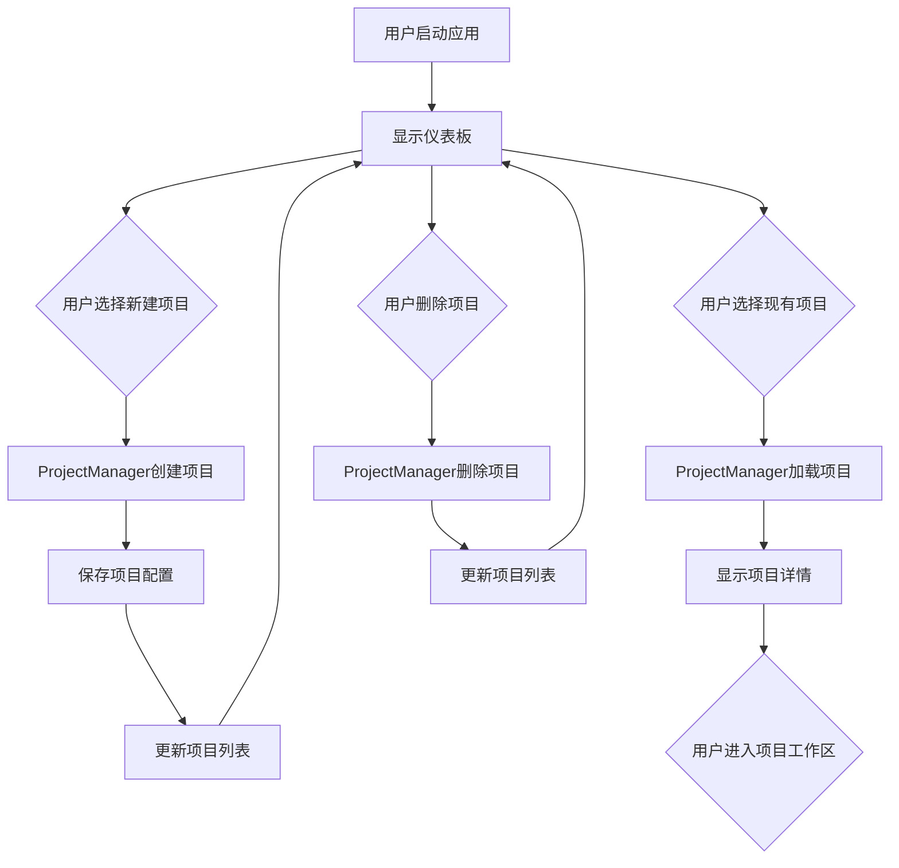
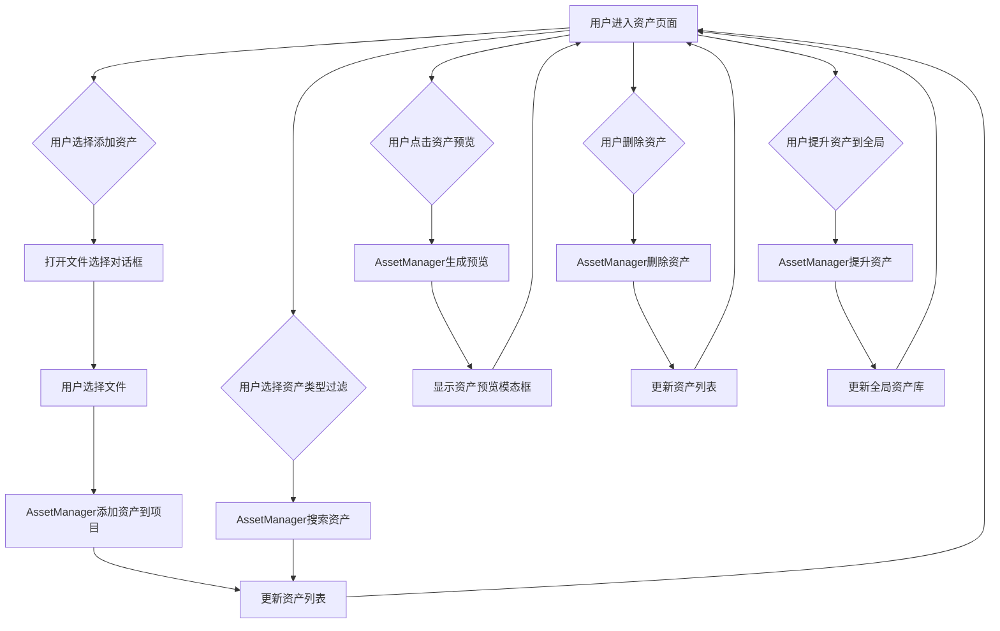
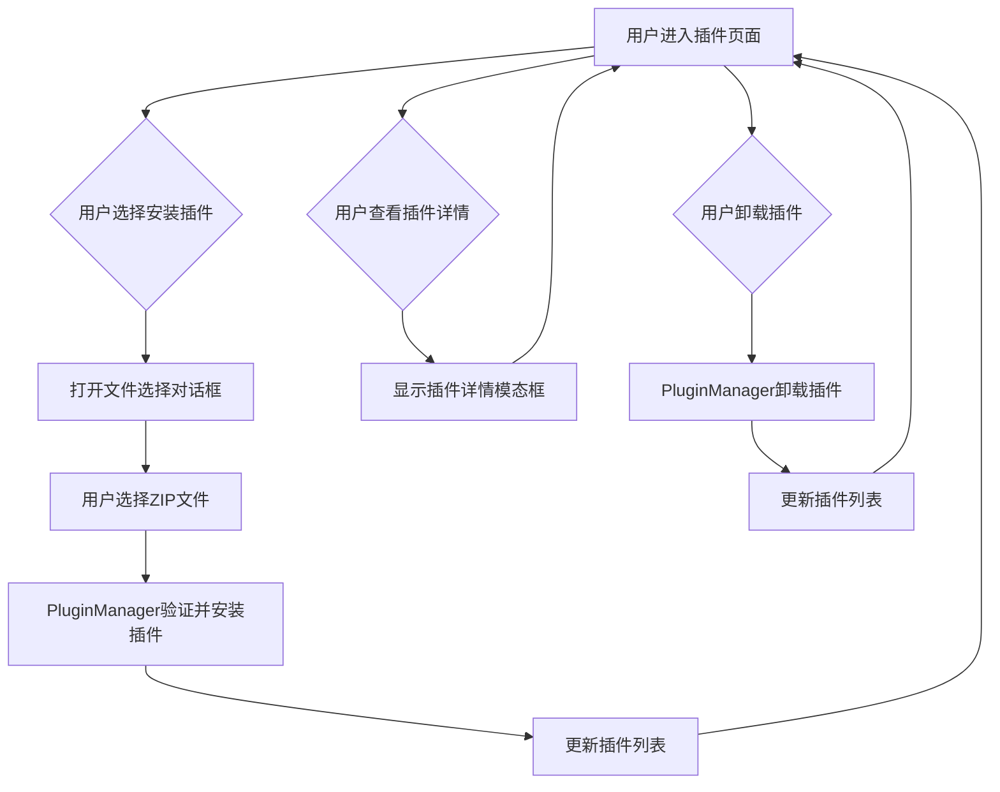
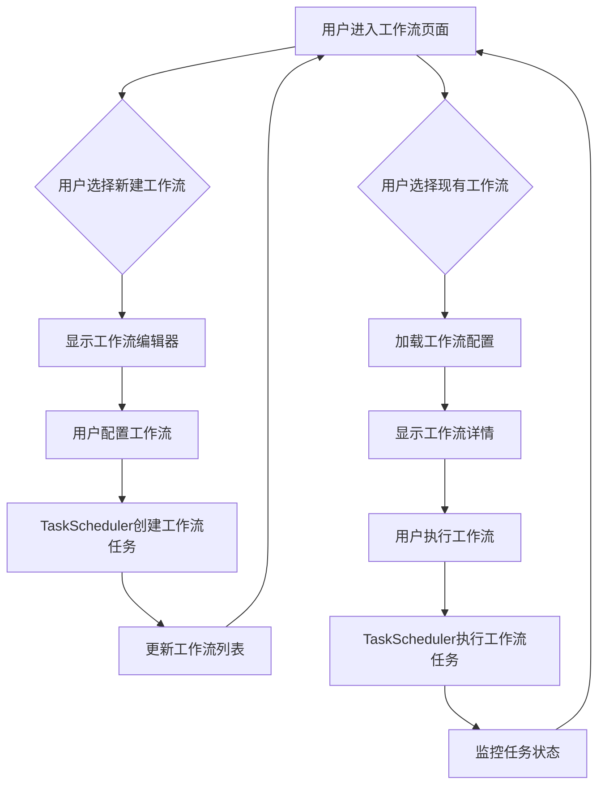
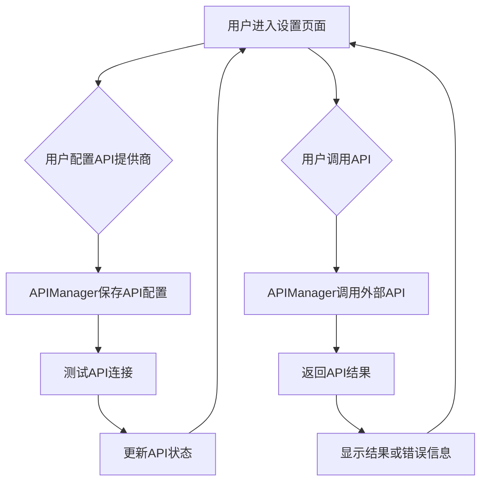

# MATRIX Studio 当前版本详细说明

## 版本信息
- **当前版本**: v0.2.2
- **发布日期**: 2025-12-25
- **开发阶段**: Phase 2 - 核心服务实现与UI功能连接

---

## 1. 目录和文件结构架构

### 1.1 根目录结构

```
matrix/
├── .eslintrc.json              # ESLint配置文件
├── .gitignore                 # Git忽略文件配置
├── .prettierrc.json            # Prettier代码格式化配置
├── CHANGELOG.md                # 版本变更记录
├── CLAUDE.md                  # Claude AI相关文档
├── package.json                # 项目依赖和脚本配置
├── README.md                   # 项目说明文档
├── tsconfig.json               # TypeScript编译配置
├── .claude/                   # Claude AI配置目录
├── .roo/                     # Roo AI配置目录
├── assets/                    # 应用UI资源文件
├── backup/                    # 备份目录（包含旧版本组件和样式）
│   ├── components/              # 备份的UI组件
│   └── styles/                # 备份的样式文件
├── config/                    # 构建和打包配置
│   ├── electron-builder.json     # Electron应用打包配置
│   ├── jest.config.js           # Jest测试框架配置
│   └── webpack.*.js           # Webpack模块打包配置（主进程、渲染进程、预加载）
├── docs/                      # 项目文档
│   ├── 00-global-requirements-v1.0.0.md    # 全局需求文档
│   ├── 01-architecture-design-v1.0.0.md      # 架构设计文档
│   ├── 02-technical-blueprint-v1.0.0.md        # 技术蓝图文档
│   ├── 04-initialization-guidelines-v1.0.0.md   # 初始化指南
│   ├── 05-project-structure-v1.0.1.md          # 项目结构规划
│   ├── 06-core-services-design-v1.0.1.md       # 核心服务设计
│   └── references/             # 参考文档和UI原型
├── global-assets/              # 全局资产库（当前为空目录，待实现）
├── library/                    # 全局资产库（faces、styles、workflows、media、metadata）
├── logs/                      # 日志文件存储
│   └── development/            # 开发进度日志
├── plans/                     # 项目计划和任务清单
├── plugins/                   # 插件目录（official、community）
├── projects/                  # 用户项目存储目录（当前为空）
├── resources/                 # 应用资源文件（图标等）
├── screenshots/               # 应用截图
├── scripts/                   # 构建和部署脚本
├── src/                       # 源代码目录
└── tests/                     # 测试文件目录
```

### 1.2 源代码结构

```
src/
├── common/                     # 共享类型定义
│   └── types.ts              # 全局类型定义（项目、资产、插件、任务、API等）
├── main/                       # Electron主进程代码
│   ├── index.ts              # 主进程入口文件，应用初始化和服务启动
│   ├── window.ts             # 窗口管理器，创建和控制BrowserWindow
│   ├── ipc/                  # IPC通信处理
│   │   ├── channels.ts      # IPC通道定义
│   │   └── handlers/      # IPC处理器实现
│   ├── models/               # 数据模型定义
│   │   ├── project.ts      # 项目数据模型
│   │   └── ...其他模型
│   ├── services/             # 核心服务实现
│   │   ├── Logger.ts        # 日志服务（已实现）
│   │   ├── ServiceErrorHandler.ts  # 错误处理服务（已实现）
│   │   ├── TimeService.ts    # 时间服务（已实现）
│   │   ├── ProjectManager.ts # 项目管理器（已实现）
│   │   ├── AssetManager.ts   # 资产管理器（已实现）
│   │   ├── PluginManager.ts  # 插件管理器（已实现）
│   │   ├── TaskScheduler.ts  # 任务调度器（已实现）
│   │   └── APIManager.ts     # API管理器（已实现）
│   └── utils/               # 工具函数
│       ├── file-utils.ts     # 文件操作工具
│       ├── path-utils.ts     # 路径处理工具
│       ├── security.ts       # 安全验证工具
│       └── validation.ts     # 数据验证工具
├── preload/                    # 预加载脚本
│   └── index.ts             # 安全的IPC桥接实现
└── renderer/                   # React渲染进程代码
    ├── index.html           # HTML模板
    ├── index.tsx            # React应用入口
    ├── App.tsx             # 应用根组件
    ├── components/          # UI组件
    │   ├── common/          # 通用组件（Button、Card、Modal等）
    │   └── pages/           # 页面组件
    ├── pages/               # 页面实现
    │   ├── dashboard/       # 仪表板页面（项目管理）
    │   ├── assets/          # 资产管理页面
    │   ├── plugins/         # 插件管理页面
    │   ├── workflows/        # 工作流管理页面
    │   ├── settings/        # 设置页面
    │   └── about/          # 关于页面
    ├── styles/              # 样式文件
    ├── scripts/              # 前端脚本
    └── views/               # HTML视图模板
```

---

## 2. 功能模块说明

### 2.1 已实现的核心服务

#### 2.1.1 时间服务 (TimeService)
- **功能**: 提供统一的时间管理和合规性验证
- **主要特性**:
  - 系统时间获取（本地时间、UTC时间）
  - NTP网络时间同步（支持多个NTP服务器）
  - 时间完整性验证（防止时间篡改）
  - 时间操作装饰器（强制验证时间有效性）
  - 时间监控和日志记录
- **实现状态**: ✅ 完整实现

#### 2.1.2 项目管理器 (ProjectManager)
- **功能**: 管理项目生命周期和配置
- **主要特性**:
  - 项目创建、加载、保存、删除
  - 项目模板系统
  - 项目列表管理
  - 全局资产链接管理
- **实现状态**: ✅ 完整实现

#### 2.1.3 资产管理器 (AssetManager)
- **功能**: 统一管理项目私有资产和全局资产
- **主要特性**:
  - 资产添加、删除、更新、搜索
  - 资产预览生成
  - 资产提升（项目→全局）
  - 双重作用域管理（project/global）
  - AI属性支持（LoRA、触发词、种子等）
- **实现状态**: ✅ 完整实现

#### 2.1.4 插件管理器 (PluginManager)
- **功能**: 插件生命周期管理和执行
- **主要特性**:
  - 插件加载、卸载、执行
  - 插件类型区分（official/community）
  - 插件权限管理
  - ZIP包安装和验证
  - 插件清单读取和验证
  - 安全解压和路径验证
- **实现状态**: ✅ MVP版本实现（非沙箱执行）

#### 2.1.5 任务调度器 (TaskScheduler)
- **功能**: 任务创建、执行、状态管理
- **主要特性**:
  - 任务队列管理（内存队列）
  - 多种任务类型支持（API调用、插件、工作流、自定义）
  - 异步任务执行
  - 任务状态跟踪（pending/running/completed/failed/cancelled）
  - 任务进度监控
  - 任务取消和结果获取
- **实现状态**: ✅ MVP版本实现

#### 2.1.6 API管理器 (APIManager)
- **功能**: 外部API统一管理和调用
- **主要特性**:
  - 多提供商支持（OpenAI、Anthropic、Ollama、SiliconFlow）
  - API注册和配置管理
  - API密钥安全存储
  - API调用封装和错误处理
  - API状态检查和缓存
  - 请求超时和重试机制
- **实现状态**: ✅ MVP版本实现

#### 2.1.7 日志服务 (Logger)
- **功能**: 统一日志管理和输出
- **主要特性**:
  - 多级别日志（debug/info/warn/error）
  - 文件和控制台双输出
  - 日志轮转（按文件大小）
  - 日志清理（保留指定天数）
  - 结构化日志格式
  - 服务标识和操作追踪
- **实现状态**: ✅ 完整实现

#### 2.1.8 错误处理服务 (ServiceErrorHandler)
- **功能**: 统一错误处理和用户友好消息
- **主要特性**:
  - 错误分类和代码映射（70+错误码）
  - 用户友好错误消息映射
  - 错误上下文记录
  - 服务错误包装和自动处理
  - 错误日志记录
- **实现状态**: ✅ 完整实现

### 2.2 已实现的UI功能模块

#### 2.2.1 通用UI组件
- **Button**: 按钮组件（primary/ghost/variant）
- **Card**: 卡片组件（支持标签、图标、悬停效果）
- **Modal**: 模态框组件（支持ESC关闭、点击外部关闭）
- **ConfirmDialog**: 确认对话框（danger/warning/info类型）
- **Toast**: 通知组件（success/error/warning/info类型）
- **Loading**: 加载指示器（支持3种尺寸和全屏模式）
- **GlobalNav**: 全局导航组件（支持折叠/展开动画）
- **WindowBar**: 窗口控制栏（最小化、最大化、关闭）
- **Layout**: 布局组件（全屏布局、内容区域滚动）
- **Icon**: 图标组件
- **AssetPreview**: 资产预览组件

#### 2.2.2 页面组件
- **Dashboard**: 项目管理仪表板
  - 项目列表展示（网格布局）
  - 项目创建功能（模态框）
  - 项目删除功能（确认对话框）
  - 空状态处理
  - 加载状态和错误处理
  
- **Assets**: 资产管理页面
  - 资产列表展示（支持类型过滤）
  - 资产添加功能（文件选择对话框）
  - 资产删除功能（确认对话框）
  - 资产预览功能
  - 空状态处理
  
- **Plugins**: 插件管理页面
  - 插件列表展示（官方/社区分类）
  - 插件详情模态框
  - 插件安装功能（ZIP文件）
  - 插件卸载功能（确认对话框）
  - 空状态处理
  
- **Settings**: 设置页面
  - API提供商配置（Ollama、OpenAI、SiliconFlow）
  - API密钥管理
  - 连接测试功能
  - 侧边栏导航（搜索框、提供商列表）
  - 标签页切换
  
- **Workflows**: 工作流管理页面
  - 工作流列表展示
  - 工作流编辑器页面
- **WorkflowEditor**: 工作流编辑器
- **About**: 关于页面

---

## 3. 计划中但未实现的功能模块

### 3.1 全局资产库 (Library)
- **计划功能**:
  - 资产分类管理（faces、styles、workflows、media、metadata）
  - 资产搜索和索引
  - 资产包导出/导入
  - 资产市场集成
  - 资产版本管理
- **当前状态**: 🚧 目录结构已创建，但功能未实现

### 3.2 MCP服务集成
- **计划功能**:
  - MCP服务连接和管理
  - MCP服务发现和注册
  - MCP服务调用封装
  - MCP服务状态监控
- **当前状态**: 🚧 IPC通道已定义，但返回模拟数据

### 3.3 本地服务管理
- **计划功能**:
  - 本地服务启动/停止
  - 本地服务状态监控
  - 本地服务配置管理
  - 服务健康检查
- **当前状态**: 🚧 IPC通道已定义，但返回模拟数据

### 3.4 工作流引擎
- **计划功能**:
  - ComfyUI适配器（AI图像生成工作流）
  - N8N适配器（自动化工作流）
  - 工作流可视化编辑器
  - 工作流模板市场
  - 工作流执行引擎
- **当前状态**: 🚧 基础文件操作已实现，但引擎未集成

### 3.5 插件沙箱系统
- **计划功能**:
  - 插件沙箱执行环境
  - 插件权限细粒度控制
  - 插件资源隔离
  - 插件性能监控
  - 插件签名验证
- **当前状态**: 🚧 当前为直接require加载，后续需升级为沙箱

### 3.6 编辑与修复引擎
- **计划功能**:
  - 角色一致性修复工具
  - 局部重绘与修复
  - 分镜调整工具
  - 参数微调接口
  - 批量编辑功能
- **当前状态**: 🚧 完全未实现

---

## 4. 业务流程总结

基于当前UI和代码实现，反推的业务流程如下：

### 4.1 项目管理流程


### 4.2 资产管理流程


### 4.3 插件管理流程


### 4.4 工作流管理流程


### 4.5 API管理流程


---

## 5. 当前版本的技术债务

### 5.1 架构层面
- **插件沙箱系统**: 当前插件直接使用require()加载，存在安全风险
- **工作流引擎集成**: 工作流执行仅为模拟实现，未与实际引擎集成
- **MCP服务集成**: MCP服务仅为模拟响应，未实现真实连接
- **本地服务管理**: 本地服务仅为模拟响应，未实现真实服务
- **全局资产库**: 全局资产库目录结构已创建，但功能未实现
- **错误恢复机制**: 缺乏全局错误恢复和重试机制
- **性能监控**: 缺乏系统性能监控和分析

### 5.2 代码层面
- **类型安全**: 部分代码使用any类型，缺乏严格类型检查
- **错误处理**: 部分异步操作缺乏完善的错误处理
- **内存管理**: 大文件操作缺乏流式处理，可能导致内存问题
- **测试覆盖**: 核心服务缺乏完整的单元测试和集成测试
- **代码重复**: 部分工具函数存在重复实现

### 5.3 UI/UX层面
- **响应式设计**: 当前UI缺乏完善的响应式适配
- **无障碍支持**: 缺乏键盘导航和屏幕阅读器支持
- **国际化**: 界面文本硬编码，缺乏多语言支持
- **主题系统**: 缺乏统一的主题切换和自定义功能
- **加载状态**: 部分操作缺乏清晰的加载状态指示

### 5.4 安全层面
- **输入验证**: 部分用户输入缺乏严格的验证和清理
- **权限控制**: 插件权限控制较为粗糙，缺乏细粒度管理
- **数据加密**: 敏感数据（如API密钥）存储缺乏加密
- **审计日志**: 缺乏用户操作的详细审计日志

---

## 6. 后续开发建议

### 6.1 短期优化（v0.3.0）
1. 完善插件沙箱系统
2. 集成真实工作流引擎
3. 实现MCP服务连接
4. 完善全局资产库功能
5. 加强错误处理和恢复机制
6. 优化性能监控和内存管理

### 6.2 中期功能（v0.4.0）
1. 实现编辑与修复引擎
2. 添加工作流可视化编辑器
3. 完善本地服务管理
4. 实现工作流模板市场
5. 加强安全性和权限控制
6. 添加国际化支持

### 6.3 长期规划（v1.0.0）
1. 完善插件生态系统
2. 实现分布式任务处理
3. 添加协作功能
4. 实现高级分析功能
5. 优化用户体验
6. 建立开发者生态系统

---

## 总结

MATRIX Studio当前版本v0.2.2已实现了完整的核心服务架构和基础UI功能，主要完成了：

1. **完整的服务层实现**: 7个核心服务已全部实现MVP版本
2. **基础UI功能**: 主要页面和通用组件已完成
3. **项目结构清晰**: 采用分层架构，代码组织良好
4. **类型安全**: 完整的TypeScript类型定义

当前处于从MVP向完整产品过渡的关键阶段，后续需要重点关注工作流引擎集成、插件沙箱系统和全局资产库功能的完善。