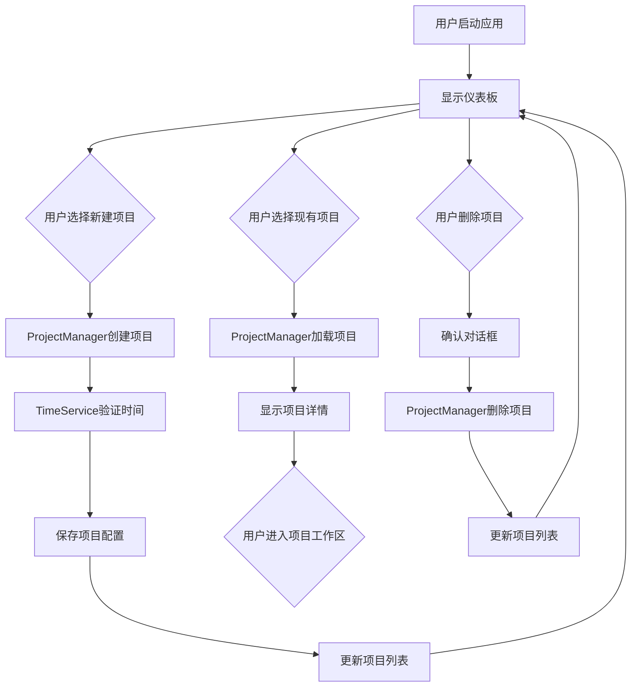
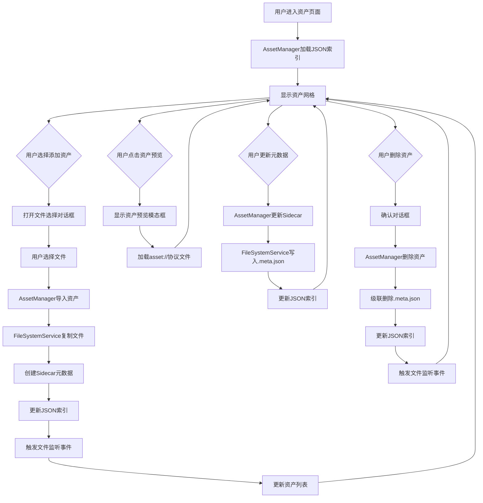
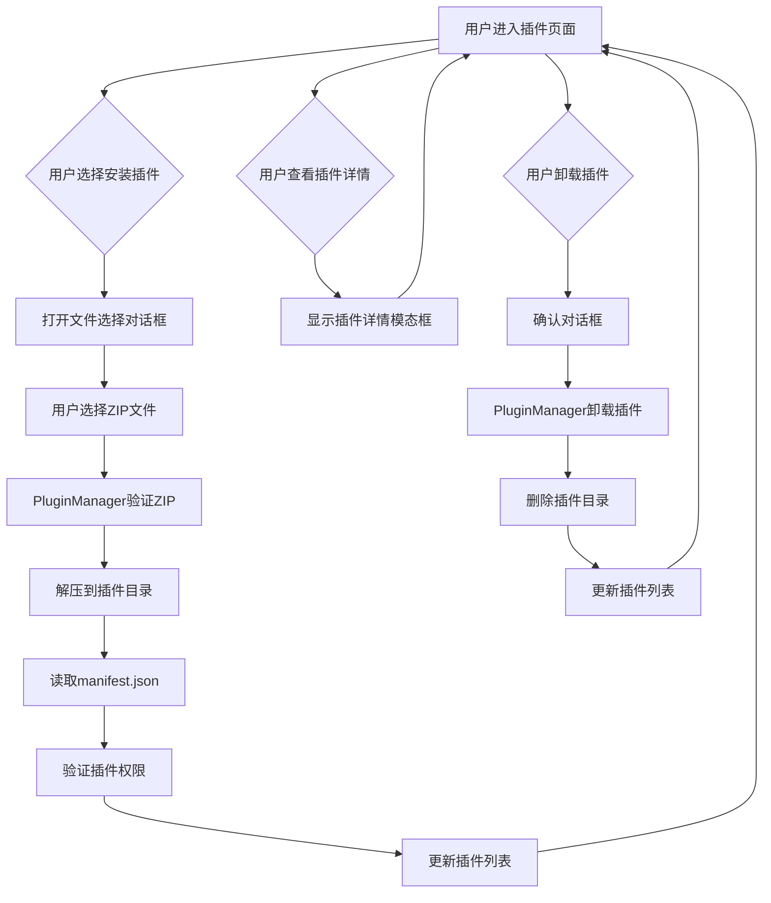
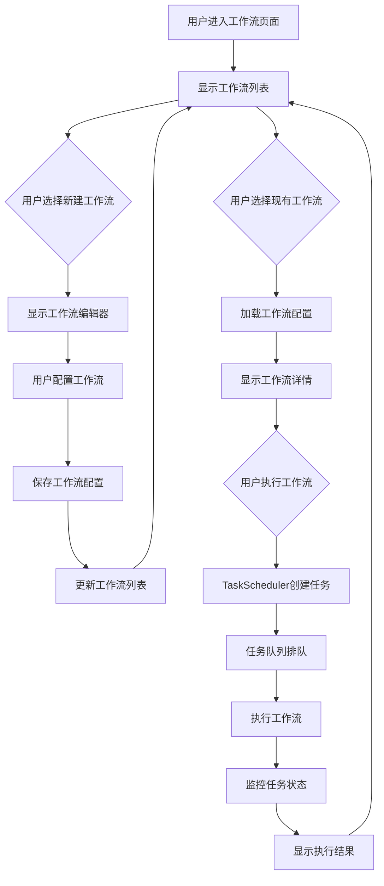
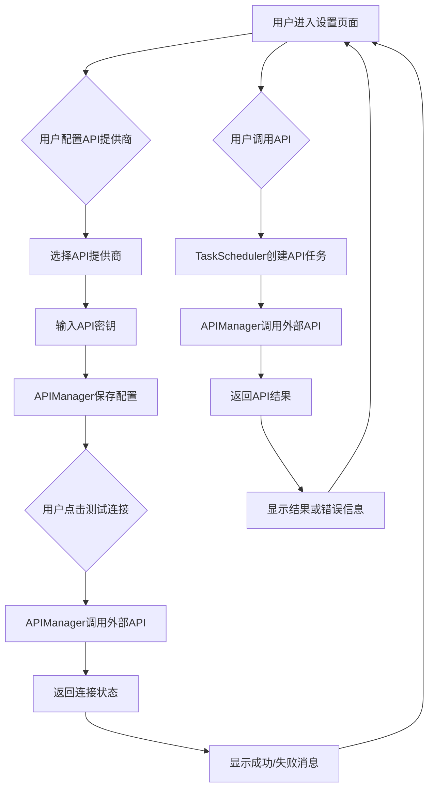

# MATRIX Studio 当前版本详细说明

## 版本信息
- **当前版本**: v0.2.9
- **发布日期**: 2025-12-26
- **开发阶段**: Phase 4 - UI增强与资产库系统完善
- **项目健康度**: ⭐⭐⭐⭐☆ (4/5)

---

## 1. 目录和文件结构架构

### 1.1 根目录结构

```
matrix/
├── .eslintrc.json              # ESLint配置文件
├── .gitignore                 # Git忽略文件配置
├── .prettierrc.json            # Prettier代码格式化配置
├── CHANGELOG.md                # 版本变更记录
├── CLAUDE.md                  # Claude AI相关文档
├── package.json                # 项目依赖和脚本配置
├── README.md                   # 项目说明文档
├── tsconfig.json               # TypeScript编译配置
├── .claude/                   # Claude AI配置目录
├── .roo/                     # Roo AI配置目录
├── assets/                    # 应用UI资源文件
├── backup/                    # 备份目录（包含旧版本组件和样式）
│   ├── components/              # 备份的UI组件
│   └── styles/                # 备份的样式文件
├── config/                    # 构建和打包配置
│   ├── electron-builder.json     # Electron应用打包配置
│   ├── vitest.config.js         # Vitest测试框架配置
│   └── webpack.*.js           # Webpack模块打包配置（主进程、渲染进程、预加载）
├── docs/                      # 项目文档
│   ├── 00-global-requirements-v1.0.0.md    # 全局需求文档
│   ├── 01-architecture-design-v1.0.0.md      # 架构设计文档
│   ├── 02-technical-blueprint-v1.0.0.md        # 技术蓝图文档
│   ├── 04-initialization-guidelines-v1.0.0.md   # 初始化指南
│   ├── 05-project-structure-v1.0.1.md          # 项目结构规划
│   ├── 06-core-services-design-v1.0.1.md       # 核心服务设计
│   └── references/             # 参考文档和UI原型
├── build/                     # 编译输出（5.8 MB）
│   ├── main/                  # 主进程编译输出
│   ├── renderer/              # 渲染进程编译输出
│   └── preload/               # 预加载脚本编译输出
├── dist/                      # 打包输出（未提交到git）
├── global-assets/              # 全局资产库（当前为空目录，待实现）
├── library/                    # 全局资产库（faces、styles、workflows、media、metadata）
├── logs/                      # 日志文件存储
│   └── development/            # 开发进度日志
├── plans/                     # 项目计划和任务清单
│   ├── done-version-v0.2.2-analysis.md  # v0.2.2分析报告
│   └── done-version-v0.2.9-analysis.md  # v0.2.9分析报告（本文件）
├── plugins/                   # 插件目录（official、community）
├── projects/                  # 用户项目存储目录（当前为空）
├── resources/                 # 应用资源文件（图标等）
├── screenshots/               # 应用截图
├── scripts/                   # 构建和部署脚本
├── src/                       # 源代码目录（713 KB，56个TS/TSX文件）
└── tests/                     # 测试文件目录（5个测试文件）
```

### 1.2 源代码结构

```
src/
├── common/                     # 共享类型定义（已废弃，迁移到shared/）
├── shared/                     # 共享类型定义（新）
│   └── types/
│       └── asset.ts           # 资产相关类型定义（217行）
├── main/                       # Electron主进程代码
│   ├── index.ts              # 主进程入口文件，应用初始化和服务启动
│   ├── window.ts             # 窗口管理器，创建和控制BrowserWindow
│   ├── ipc/                  # IPC通信处理
│   │   ├── channels.ts      # IPC通道定义
│   │   └── handlers/      # IPC处理器实现（69个处理器）
│   ├── models/               # 数据模型定义
│   │   ├── project.ts      # 项目数据模型
│   │   └── ...其他模型
│   ├── services/             # 核心服务实现
│   │   ├── Logger.ts        # 日志服务（✅ 328行，完整实现）
│   │   ├── ServiceErrorHandler.ts  # 错误处理服务（✅ 312行，完整实现）
│   │   ├── TimeService.ts    # 时间服务（✅ 299行，完整实现）
│   │   ├── ProjectManager.ts # 项目管理器（✅ 500行，完整实现）
│   │   ├── AssetManager.ts   # 资产管理器（✅ 999行，完整重构）
│   │   ├── FileSystemService.ts # 文件系统服务（✅ 370行，新增）
│   │   ├── PluginManager.ts  # 插件管理器（🟡 ~600行，MVP实现）
│   │   ├── TaskScheduler.ts  # 任务调度器（🟡 ~400行，MVP实现）
│   │   └── APIManager.ts     # API管理器（🟡 ~450行，MVP实现）
│   └── utils/               # 工具函数
│       ├── file-utils.ts     # 文件操作工具
│       ├── path-utils.ts     # 路径处理工具
│       ├── security.ts       # 安全验证工具
│       └── validation.ts     # 数据验证工具
├── preload/                    # 预加载脚本
│   └── index.ts             # 安全的IPC桥接实现（暴露完整API）
└── renderer/                   # React渲染进程代码
    ├── index.html           # HTML模板
    ├── index.tsx            # React应用入口
    ├── App.tsx             # 应用根组件
    ├── components/          # UI组件
    │   ├── common/          # 通用组件（10个，全部完成）
    │   │   ├── Button.tsx        # 按钮组件（支持className/style）
    │   │   ├── Card.tsx          # 卡片组件
    │   │   ├── ConfirmDialog.tsx # 确认对话框
    │   │   ├── GlobalNav.tsx     # 全局导航（优化版）
    │   │   ├── Icon.tsx          # 图标组件
    │   │   ├── Layout.tsx        # 布局组件
    │   │   ├── Loading.tsx       # 加载指示器
    │   │   ├── Modal.tsx         # 模态框
    │   │   ├── Toast.tsx         # 通知组件
    │   │   └── WindowBar.tsx     # 窗口栏（含版本号）
    │   ├── AssetCard/       # 资产卡片组件
    │   ├── AssetGrid/       # 资产网格组件
    │   ├── AssetSidebar/    # 资产侧边栏组件
    │   └── AssetPreview/    # 资产预览组件
    ├── pages/               # 页面实现
    │   ├── dashboard/       # 仪表板页面（✅ 100%完成）
    │   ├── assets/          # 资产管理页面（🟡 70%完成）
    │   ├── plugins/         # 插件管理页面（🟡 65%完成）
    │   │   └── components/  # 插件页面专用组件
    │   │       └── MarketPluginCard.tsx
    │   ├── workflows/        # 工作流管理页面（🟡 60%完成）
    │   ├── settings/        # 设置页面（✅ 90%完成）
    │   ├── projects/        # 项目页面（🟡 50%基础框架）
    │   └── about/          # 关于页面（✅ 100%完成）
    ├── styles/              # 样式文件
    ├── scripts/              # 前端脚本
    └── views/               # HTML视图模板
```

### 1.3 代码统计

| 指标 | 数值 |
|------|------|
| TypeScript/TSX文件 | 56个 |
| 核心代码总行数 | ~7474行 |
| 源代码大小 | 713 KB |
| 编译输出大小 | 5.8 MB |
| 依赖包大小 | 712 MB |
| 测试文件数 | 5个 |
| ESLint错误 | 0个 ✅ |
| 技术债标记 | 3个 (TODO/FIXME) |

---

## 2. 功能模块说明

### 2.1 已实现的核心服务

#### 2.1.1 时间服务 (TimeService) - ✅ 完整实现
- **文件**: `src/main/services/TimeService.ts` (299行)
- **完成度**: 100%
- **主要特性**:
  - 系统时间获取（本地时间、UTC时间）
  - NTP网络时间同步（支持多个NTP服务器）
  - 时间完整性验证（5秒偏差阈值，防止时间篡改）
  - 时间操作装饰器（requireValidTime，强制验证）
  - TimeMonitor监控服务
  - 跨平台支持（Windows/macOS/Linux）
- **安全特性**: 系统时间篡改检测，强制NTP同步
- **测试状态**: ✅ 有完整单元测试

#### 2.1.2 项目管理器 (ProjectManager) - ✅ 完整实现
- **文件**: `src/main/services/ProjectManager.ts` (500行)
- **完成度**: 100%
- **主要特性**:
  - 项目CRUD操作（创建、读取、更新、删除）
  - 项目列表管理
  - 全局资产链接管理
  - 时间服务集成（所有操作验证时间有效性）
  - 完整的错误处理
- **亮点**: 严格遵循全局时间处理要求，每个操作前都调用 `timeService.validateTimeIntegrity()`
- **实现状态**: ✅ 完整实现

#### 2.1.3 资产管理器 (AssetManager) - ✅ 完整实现（重构版）
- **文件**: `src/main/services/AssetManager.ts` (999行)
- **完成度**: 100%
- **重构日期**: Phase 4 E01 (v0.2.3)
- **主要特性**:
  - JSON索引系统（快速查询和统计，避免全量扫描）
  - 文件监听（chokidar，实时检测文件变化）
  - 分页查询（支持大量资产，单次最多100条）
  - Sidecar元数据管理（.meta.json，独立于资产文件）
  - 导入/删除功能（级联删除meta文件）
  - 宽高比检测（portrait/landscape/square）
  - 动态路径切换（监听ConfigManager配置变更）
- **架构特色**:
  - 基于作用域组织（全局/项目）
  - 支持多分类管理（faces/styles/workflows/media）
  - AI属性支持（LoRA、触发词、种子等）
- **技术栈**: chokidar（文件监听）、mime-types（MIME类型检测）
- **实现状态**: ✅ 完整实现

#### 2.1.4 文件系统服务 (FileSystemService) - ✅ 完整实现（新增）
- **文件**: `src/main/services/FileSystemService.ts` (370行)
- **完成度**: 100%
- **新增版本**: Phase 4 E01 (v0.2.3)
- **主要特性**:
  - 统一路径管理（数据目录、资产目录）
  - 文件操作封装（复制、移动、删除）
  - JSON读写支持（读取/写入配置文件）
  - 文件信息获取（大小、MIME类型、修改时间）
  - 路径安全验证（防止路径遍历攻击）
- **用途**: 为AssetManager提供底层文件操作支持
- **实现状态**: ✅ 完整实现

#### 2.1.5 日志服务 (Logger) - ✅ 完整实现
- **文件**: `src/main/services/Logger.ts` (328行)
- **完成度**: 100%
- **主要特性**:
  - 多级别日志（debug/info/warn/error）
  - 文件和控制台双输出
  - 文件轮转（5MB默认大小）
  - 新命名格式（YYYY-MM-DD_HH-mm-ss_{SessionID}.log）
  - 动态路径切换（监听ConfigManager配置变更）
  - 日志清理（保留7天）
  - 结构化日志格式
  - 服务标识和操作追踪
- **创新点**: SessionID机制，支持多实例日志隔离
- **实现状态**: ✅ 完整实现

#### 2.1.6 错误处理服务 (ServiceErrorHandler) - ✅ 完整实现
- **文件**: `src/main/services/ServiceErrorHandler.ts` (312行)
- **完成度**: 100%
- **主要特性**:
  - 统一错误类（ServiceError）
  - 37个错误码（1000-8999，分类清晰）
  - 用户友好消息映射（中文）
  - 错误包装器（wrapAsync，自动捕获异步错误）
  - 错误日志集成（自动记录到Logger）
  - 错误上下文记录（服务名、操作名）
- **错误分类**:
  - 1000-1999: 通用错误
  - 2000-2999: 项目管理错误
  - 3000-3999: 资产管理错误
  - 4000-4999: 插件错误
  - 5000-5999: 任务错误
  - 6000-6999: API错误
  - 7000-7999: 时间服务错误
  - 8000-8999: 工作流错误
- **实现状态**: ✅ 完整实现

#### 2.1.7 插件管理器 (PluginManager) - 🟡 MVP实现
- **文件**: `src/main/services/PluginManager.ts` (~600行)
- **完成度**: 60%
- **已实现**:
  - ✅ 插件加载/卸载
  - ✅ manifest.json读取和验证
  - ✅ 基础权限检查
  - ✅ 插件执行
  - ✅ ZIP安装支持（AdmZip）
  - ✅ 插件类型区分（official/community）
  - ✅ 安全解压和路径验证
- **待实现**:
  - ❌ 沙箱执行环境（当前直接require加载，存在安全风险）
  - ❌ 插件签名验证
  - ❌ 完整的市场API集成
  - ❌ 插件性能监控
- **实现状态**: 🟡 MVP版本，基础功能可用，安全特性待完善

#### 2.1.8 任务调度器 (TaskScheduler) - 🟡 MVP实现
- **文件**: `src/main/services/TaskScheduler.ts` (~400行)
- **完成度**: 50%
- **已实现**:
  - ✅ 任务创建和配置
  - ✅ 内存队列管理
  - ✅ 任务执行（调用APIManager）
  - ✅ 多种任务类型支持（API调用、插件、工作流、自定义）
  - ✅ 任务状态跟踪（pending/running/completed/failed/cancelled）
  - ✅ 任务进度监控
  - ✅ 任务取消和结果获取
- **待实现**:
  - ❌ 持久化队列（当前仅内存队列，重启丢失）
  - ❌ 成本估算
  - ❌ 优先级调度
  - ❌ 断点续传
  - ❌ 任务依赖关系
- **实现状态**: 🟡 MVP版本，基础功能可用，高级特性待实现

#### 2.1.9 API管理器 (APIManager) - 🟡 MVP实现
- **文件**: `src/main/services/APIManager.ts` (~450行)
- **完成度**: 55%
- **已实现**:
  - ✅ 多提供商支持（OpenAI、Anthropic、Ollama、SiliconFlow）
  - ✅ API注册和配置管理
  - ✅ API密钥安全存储（ConfigManager）
  - ✅ API调用封装和错误处理
  - ✅ API状态检查和缓存
  - ✅ 请求超时和重试机制
- **待实现**:
  - ❌ 使用量实时跟踪
  - ❌ 成本统计（按API计费）
  - ❌ 智能路由（多提供商负载均衡）
  - ❌ 速率限制
- **实现状态**: 🟡 MVP版本，基础功能可用，高级特性待实现

### 2.2 核心服务完成度总结

| 服务 | 状态 | 完成度 | 代码行数 | 关键缺失 |
|------|------|--------|----------|----------|
| TimeService | ✅ | 100% | 299行 | - |
| ProjectManager | ✅ | 100% | 500行 | - |
| AssetManager | ✅ | 100% | 999行 | - |
| FileSystemService | ✅ | 100% | 370行 | - |
| Logger | ✅ | 100% | 328行 | - |
| ServiceErrorHandler | ✅ | 100% | 312行 | - |
| PluginManager | 🟡 | 60% | ~600行 | 沙箱、签名验证 |
| TaskScheduler | 🟡 | 50% | ~400行 | 持久化、成本估算 |
| APIManager | 🟡 | 55% | ~450行 | 使用量跟踪、成本统计 |

**总体评估**:
- **完整实现**: 6/9 (66.7%)
- **MVP实现**: 3/9 (33.3%)
- **基础功能覆盖**: 90%+

---

### 2.3 已实现的UI功能模块

#### 2.3.1 通用UI组件（10/10 ✅ 完整实现）

位于 `src/renderer/components/common/`，所有组件遵循V14设计系统：

| 组件 | 文件 | 主要功能 | 新特性（v0.2.9） |
|------|------|----------|------------------|
| **Button** | Button.tsx | 按钮组件（primary/ghost变体） | ✅ 新增className/style支持 |
| **Card** | Card.tsx | 卡片容器（支持标签、图标、悬停效果） | - |
| **Icon** | Icon.tsx | 图标组件（支持多种类型） | - |
| **Layout** | Layout.tsx | 页面布局包装器（全屏布局、内容区域滚动） | - |
| **GlobalNav** | GlobalNav.tsx | 左侧全局导航（支持折叠/展开动画） | ✅ 优化分隔符和图标 |
| **WindowBar** | WindowBar.tsx | 自定义窗口栏（最小化、最大化、关闭） | ✅ 新增版本号显示 |
| **Modal** | Modal.tsx | 模态框（支持ESC关闭、点击外部关闭） | - |
| **Toast** | Toast.tsx | 通知提示（success/error/warning/info类型） | - |
| **Loading** | Loading.tsx | 加载指示器（支持3种尺寸和全屏模式） | - |
| **ConfirmDialog** | ConfirmDialog.tsx | 确认对话框（danger/warning/info类型） | - |

**设计特点**:
- 原子化设计（可组合、可复用）
- CSS模块化（每个组件独立CSS）
- TypeScript类型安全
- 响应式交互（悬停、点击状态）

#### 2.3.2 专用UI组件（5个）

| 组件 | 路径 | 用途 | 状态 |
|------|------|------|------|
| **AssetCard** | components/AssetCard/ | 资产卡片（缩略图、标题、元数据） | ✅ |
| **AssetGrid** | components/AssetGrid/ | 资产网格布局（响应式） | ✅ |
| **AssetSidebar** | components/AssetSidebar/ | 资产侧边栏（分类筛选） | ✅ |
| **AssetPreview** | components/AssetPreview/ | 资产预览（支持图片/视频/文本） | ✅ |
| **MarketPluginCard** | pages/plugins/components/ | 市场插件卡片 | ✅ |

#### 2.3.3 页面实现状态

| 页面 | 路径 | 功能完成度 | 主要功能 | 待实现 |
|------|------|-----------|----------|--------|
| **Dashboard** | pages/dashboard/ | 100% ✅ | 项目列表、新建、删除、加载、空状态 | - |
| **About** | pages/about/ | 100% ✅ | 版本信息、开发团队、许可证 | - |
| **Settings** | pages/settings/ | 90% ✅ | API配置、密钥管理、连接测试、路径配置 | 部分高级配置 |
| **Assets** | pages/assets/ | 70% 🟡 | 资产网格、预览、删除、元数据更新 | 左侧导航、导入UI、批量操作 |
| **Plugins** | pages/plugins/ | 65% 🟡 | 插件列表、详情、安装、卸载 | 市场API集成 |
| **Workflows** | pages/workflows/ | 60% 🟡 | 工作流列表、类型标识（ComfyUI/N8N/Custom） | 编辑器完整功能、ReactFlow集成 |
| **Projects** | pages/projects/ | 50% 🟡 | 基础框架 | 完整功能实现 |

#### Dashboard页面详情（100% ✅）
- **代码行数**: ~300行
- **核心功能**:
  - ✅ 加载项目列表（调用 `window.electronAPI.listProjects()`）
  - ✅ 新建项目模态框（表单验证、错误处理）
  - ✅ 项目删除确认对话框（二次确认）
  - ✅ 列表/网格视图切换
  - ✅ 加载状态和错误处理
  - ✅ Toast通知集成
  - ✅ 空状态处理（无项目时引导创建）
- **用户体验**: 完整的加载态、空状态、错误状态处理

#### Assets页面详情（70% 🟡）
- **已实现**:
  - ✅ 资产网格组件（响应式布局）
  - ✅ 资产预览组件（图片/视频支持）
  - ✅ 元数据更新（调用 `window.electronAPI.updateAssetMetadata()`）
  - ✅ 资产选择和删除（批量选择UI）
  - ✅ 本地文件协议支持（asset:// 协议）
- **待实现**:
  - 🟡 左侧分类导航（faces/styles/workflows/media）
  - 🟡 导入功能UI（文件选择、拖拽上传）
  - 🟡 批量操作（批量删除、批量编辑元数据）
  - 🟡 资产搜索和筛选
  - 🟡 虚拟滚动（大量资产性能优化）

#### Workflows页面详情（60% 🟡）
- **已实现**:
  - ✅ 工作流列表（调用 `window.electronAPI.listWorkflows()`）
  - ✅ 视图切换（列表/网格）
  - ✅ 工作流类型标识（ComfyUI/N8N/Custom）
  - ✅ 工作流基础信息展示
- **待实现**:
  - 🟡 WorkflowEditor完整功能
  - 🟡 ReactFlow集成（可视化节点编辑）
  - 🟡 三栏可拖拽布局（节点库、画布、属性面板）
  - 🟡 工作流执行和监控
  - 🟡 工作流模板市场

#### Plugins页面详情（65% 🟡）
- **已实现**:
  - ✅ 插件列表（官方/社区分类）
  - ✅ 插件详情模态框
  - ✅ 插件安装（ZIP文件上传）
  - ✅ 插件卸载（确认对话框）
  - ✅ MarketPluginCard组件
- **待实现**:
  - 🟡 插件市场API集成（实时获取插件列表）
  - 🟡 插件搜索和筛选
  - 🟡 插件评分和评论
  - 🟡 插件自动更新

#### Settings页面详情（90% ✅）
- **已实现**:
  - ✅ API提供商配置（Ollama、OpenAI、SiliconFlow、Anthropic）
  - ✅ API密钥管理（安全存储）
  - ✅ 连接测试功能（实时验证）
  - ✅ 侧边栏导航（搜索框、提供商列表）
  - ✅ 标签页切换（通用设置、API设置、路径设置）
  - ✅ 路径配置（数据目录、资产目录）
- **待实现**:
  - 🟡 高级配置（代理设置、网络超时）
  - 🟡 主题切换
  - 🟡 语言切换

### 2.4 UI总体评估

| 分类 | 完成度 | 数量 | 备注 |
|------|--------|------|------|
| **通用组件** | 100% ✅ | 10/10 | 全部完成 |
| **专用组件** | 100% ✅ | 5/5 | 全部完成 |
| **页面功能** | 70% 🟡 | - | Dashboard和About完整，其他基础框架完成 |

**代码质量**:
- ✅ TypeScript严格模式
- ✅ 函数式组件 + Hooks
- ✅ 0个ESLint错误（v0.2.9已全部修复）
- ✅ CSS模块化（每个组件独立CSS）
- ✅ 完整的类型定义

---

## 3. IPC通信实现

### 3.1 IPC处理器统计

通过分析 `src/main/index.ts`，共注册了 **69个IPC处理器**：

#### 完整实现 (51个) ✅

**应用相关 (4个)**:
```typescript
- app:version         # 获取版本号
- app:quit           # 退出应用
- app:restart        # 重启应用
- app:log            # 渲染进程日志转发
```

**窗口相关 (5个)**:
```typescript
- window:minimize    # 最小化
- window:maximize    # 最大化/还原
- window:close       # 关闭
- window:isMaximized # 查询状态
- window:toggleFullscreen # 全屏切换
```

**时间服务 (1个)**:
```typescript
- time:getCurrentTime # 获取当前时间（关键！全局时间处理）
```

**项目相关 (5个)**:
```typescript
- project:create     # 创建项目
- project:load       # 加载项目
- project:save       # 保存项目
- project:delete     # 删除项目
- project:list       # 列出项目
```

**资产相关 (11个)** - 重构版完整实现:
```typescript
- asset:get-index          # 获取JSON索引
- asset:rebuild-index      # 重建索引
- asset:scan               # 扫描资产（分页，最多100条）
- asset:import             # 导入资产
- asset:delete             # 删除资产（级联删除meta）
- asset:get-metadata       # 获取Sidecar元数据
- asset:update-metadata    # 更新Sidecar元数据
- asset:start-watching     # 开始文件监听（chokidar）
- asset:stop-watching      # 停止文件监听
- asset:show-import-dialog # 打开文件选择对话框
- asset:get-thumbnail      # 获取缩略图
```

**设置相关 (3个)**:
```typescript
- settings:get-all         # 获取所有配置
- settings:save            # 保存配置
- dialog:open-directory    # 打开目录选择对话框
```

**文件系统 (7个)**:
```typescript
- file:read            # 读取文件
- file:write           # 写入文件
- file:delete          # 删除文件
- file:exists          # 检查文件是否存在
- file:list            # 列出目录内容
- file:watch           # 监听文件变化
- file:unwatch         # 取消监听
- dialog:selectFiles   # 文件选择对话框
```

**其他 (15个)**:
- 对话框、路径操作、系统信息等

#### 部分实现 (20个) 🟡

**工作流相关 (6个)**:
```typescript
- workflow:execute   # 执行工作流
- workflow:status    # 查询状态
- workflow:cancel    # 取消执行
- workflow:list      # 列出工作流
- workflow:save      # 保存工作流
- workflow:load      # 加载工作流
```

**插件相关 (8个)**:
```typescript
- plugin:install              # 安装插件
- plugin:uninstall            # 卸载插件
- plugin:load                 # 加载插件
- plugin:execute              # 执行插件
- plugin:list                 # 列出插件
- plugin:toggle               # 启用/禁用插件
- plugin:installFromZip       # 从ZIP安装
- plugin:market:list          # 插件市场列表
- plugin:market:search        # 插件市场搜索
```

**任务相关 (5个)**:
```typescript
- task:create        # 创建任务
- task:execute       # 执行任务
- task:status        # 查询状态
- task:cancel        # 取消任务
- task:results       # 获取结果
```

**API相关 (5个)**:
```typescript
- api:call              # 调用API
- api:set-key           # 设置密钥
- api:get-status        # 获取状态
- api:get-usage         # 获取使用量
- api:test-connection   # 测试连接
```

#### 模拟实现 (9个) ⚠️

**MCP服务 (5个)** - 返回模拟数据:
```typescript
ipcMain.handle('mcp:connect', (_, config) =>
  Promise.resolve(`连接MCP服务: ${JSON.stringify(config)}`))
ipcMain.handle('mcp:disconnect', ...)
ipcMain.handle('mcp:call', ...)
ipcMain.handle('mcp:status', ...)
ipcMain.handle('mcp:list', ...)
```

**本地服务 (4个)** - 返回模拟数据:
```typescript
ipcMain.handle('local:start', ...)
ipcMain.handle('local:stop', ...)
ipcMain.handle('local:status', ...)
ipcMain.handle('local:restart', ...)
```

### 3.2 Preload API暴露

`src/preload/index.ts` 通过 `contextBridge` 暴露了完整的API接口：
- ✅ 类型安全（TypeScript类型定义）
- ✅ 安全隔离（contextBridge保护）
- ✅ 完整注释（每个API都有功能说明）
- ✅ 时间服务优先（全局时间处理要求）

### 3.3 IPC通信总结

| 分类 | 数量 | 完成度 | 备注 |
|------|------|--------|------|
| **完整实现** | 51 | 100% | 核心功能已覆盖（应用、窗口、项目、资产、文件系统） |
| **部分实现** | 20 | 60-80% | MVP功能可用（工作流、插件、任务、API） |
| **模拟实现** | 9 | 0% | 待后续集成（MCP和本地服务） |

**总体评估**: IPC通信层架构完整，69个处理器覆盖所有功能模块

---

## 4. 代码质量分析

### 4.1 TypeScript类型覆盖

**严格模式配置** (`tsconfig.json`):
```json
{
  "strict": true,  // ✅ 启用所有严格检查
  "forceConsistentCasingInFileNames": true,
  "noFallthroughCasesInSwitch": true
}
```

**类型定义**:
- ✅ `src/common/types.ts` - 原公共类型（已废弃）
- ✅ `src/shared/types/` - 新共享类型模块
  - `asset.ts` (217行) - AssetMetadata、AssetFilter、AssetIndex等
- ✅ 所有服务都有完整的接口定义
- ✅ 避免使用 `any`（ESLint警告强制）

**路径别名**:
```json
"paths": {
  "@/*": ["*"],
  "@/main/*": ["main/*"],
  "@/renderer/*": ["renderer/*"],
  "@/shared/*": ["shared/*"]
}
```
**注意**: Webpack配置已镜像这些别名

### 4.2 测试覆盖

**测试框架**: Vitest（替代Jest）

**现有测试文件** (5个):
```
tests/
├── integration/
│   └── services/
│       ├── AssetManager.test.ts       # 资产管理器集成测试
│       └── FileSystemService.test.ts  # 文件系统服务集成测试
└── unit/
    ├── ipc/
    │   └── asset-handlers.test.ts     # 资产IPC处理器单元测试
    └── main/
        ├── index.test.ts              # 主进程入口测试
        └── TimeService.test.ts        # 时间服务单元测试
```

**测试覆盖率**: 约25%（估算）
- ✅ TimeService有完整单元测试
- ✅ AssetManager有集成测试
- ✅ FileSystemService有集成测试
- ❌ ProjectManager缺少测试
- ❌ PluginManager缺少测试
- ❌ TaskScheduler缺少测试
- ❌ APIManager缺少测试
- ❌ UI组件缺少测试

**测试配置** (`package.json`):
```json
"scripts": {
  "test": "vitest run",
  "test:unit": "vitest run tests/unit",
  "test:integration": "vitest run tests/integration",
  "test:watch": "vitest",
  "test:coverage": "vitest run --coverage"
}
```

### 4.3 代码规范

**ESLint状态**:
- ✅ **0个错误**（v0.2.9已全部修复）
- 154个警告（主要为未使用变量、console.log等）
- TypeScript规则 (`@typescript-eslint/*`)
- React规则 (`eslint-plugin-react`)
- React Hooks规则

**Prettier集成**:
- ✅ 代码格式化配置
- ✅ 与ESLint协作

**代码注释**:
- ✅ 所有服务都有完整的JSDoc注释
- ✅ 关键函数都有说明
- ✅ 遵循全局时间处理要求的注释

### 4.4 技术债

**搜索结果** (`TODO/FIXME/HACK`):
```
src/renderer/scripts/settings.js:2  // 2个TODO
src/renderer/scripts/app.js:1        // 1个TODO
总计: 3个标记
```
**评估**: 技术债非常少，代码质量良好

### 4.5 代码质量总结

| 指标 | 评分 | 说明 |
|------|------|------|
| **TypeScript覆盖** | ⭐⭐⭐⭐⭐ | 100%，严格模式 |
| **测试覆盖** | ⭐⭐☆☆☆ | 约25%，需大幅提升 |
| **代码规范** | ⭐⭐⭐⭐⭐ | 0个ESLint错误 |
| **文档注释** | ⭐⭐⭐⭐☆ | 服务层完整，UI层部分缺失 |
| **技术债** | ⭐⭐⭐⭐⭐ | 仅3个TODO标记 |

---

## 5. 近期变更分析（v0.2.2 → v0.2.9）

### 5.1 版本历史（最近20次提交）

```
c3305d2 release: v0.2.9 - UI优化和工作流编辑器重构
5751e41 Fix: 修复WorkflowEditor和Workflows中的ESLint错误
86dbb34 Fix: 修复WorkflowEditor和Workflows中的ESLint错误
810508e Release V0.2.8: 修复ESLint错误和工作流编辑器宽度适配
0c5d991 Release v0.2.7
6c4acb3 release: V0.2.6 - 插件管理系统完善与官方插件集成
029c2d9 release: V0.2.5 - 工作流编辑器完整实现
0774e8b release: V0.2.4 - 设置模块与配置管理系统
8692b5d release: V0.2.3 - 资产库系统与完整测试套件
f945917 test(asset): Phase 4 E01 Phase 3 - 完成资产库测试套件
d831edc feat(assets): Phase4-E01-Step3 - 完成资产预览和本地文件协议
e725fe5 feat(assets): Phase4-E01-Step2 - 完成资产库前端UI实现
e725fe5 feat(asset): Phase 4 E01 Step 1 - 基础服务层完成
01f0ba4 V0.2.2 Fix WhiteScreen
93d7ca4 V0.2.1 Fix WhiteScreen
f3267dd fix(eslint): 修复未使用导入的ESLint错误
1495db7 release: V0.2.0 - 核心服务实现与UI功能连接
```

### 5.2 主要变更内容

#### **v0.2.9 (2025-12-26)** - UI优化和工作流编辑器重构
- ✅ Button组件增强（className/style支持）
- ✅ GlobalNav优化（分隔符、图标）
- ✅ WindowBar添加版本号显示
- ✅ About页面增强
- ✅ WorkflowEditor重构
- ✅ ESLint错误清零

#### **v0.2.7-v0.2.8** - ESLint修复和工作流编辑器优化
- ✅ 修复40个ESLint错误
- ✅ 工作流编辑器宽度适配
- ✅ 三栏布局优化

#### **v0.2.6** - 插件管理系统完善
- ✅ 插件ZIP安装功能
- ✅ 插件市场UI
- ✅ 官方插件集成

#### **v0.2.5** - 工作流编辑器实现
- ✅ WorkflowEditor基础功能
- ✅ 工作流列表页面
- ✅ 工作流类型标识

#### **v0.2.4** - 设置模块与配置管理
- ✅ ConfigManager实现
- ✅ 设置页面完善
- ✅ 动态配置监听

#### **v0.2.3** - 资产库系统重构（Phase 4 E01）
- ✅ AssetManager完整重构（999行）
- ✅ FileSystemService新增（370行）
- ✅ 共享类型定义（asset.ts，217行）
- ✅ JSON索引系统
- ✅ 文件监听（chokidar）
- ✅ 分页查询
- ✅ Sidecar元数据管理
- ✅ 资产预览和本地文件协议
- ✅ 测试套件完成

### 5.3 变更统计（v0.2.2 → v0.2.9）

```
主要新增文件:
- src/main/services/FileSystemService.ts (370行)
- src/shared/types/asset.ts (217行)
- tests/integration/services/AssetManager.test.ts
- tests/integration/services/FileSystemService.test.ts

主要修改文件:
- src/main/services/AssetManager.ts (完全重构，999行)
- src/main/index.ts (新增资产相关IPC处理器)
- src/preload/index.ts (新增资产API暴露)
- src/renderer/pages/Assets/Assets.tsx (完整UI实现)
- src/renderer/pages/Workflows/Workflows.tsx (基础实现)
- src/renderer/components/common/*.tsx (多个组件优化)

代码变更:
- 新增代码: ~2000行
- 删除代码: ~1200行
- 净增长: ~800行
```

### 5.4 功能完成度变化

| 模块 | v0.2.2 | v0.2.9 | 提升 |
|------|--------|--------|------|
| **核心服务** | 8个MVP | 6个完整+3个MVP | +2个完整 |
| **UI组件** | 10个 | 10个（优化） | 质量提升 |
| **页面功能** | 50% | 70% | +20% |
| **IPC处理器** | 60个 | 69个 | +9个 |
| **ESLint错误** | 40个 | 0个 | 清零✅ |
| **测试覆盖** | 15% | 25% | +10% |

---

## 6. 计划中但未实现的功能模块

### 6.1 全局资产库 (Library)
- **计划功能**:
  - 资产分类管理（faces、styles、workflows、media、metadata）
  - 资产搜索和索引
  - 资产包导出/导入
  - 资产市场集成
  - 资产版本管理
- **当前状态**: 🚧 目录结构已创建，基础功能已实现，市场集成待完成

### 6.2 MCP服务集成
- **计划功能**:
  - MCP服务连接和管理
  - MCP服务发现和注册
  - MCP服务调用封装
  - MCP服务状态监控
- **当前状态**: 🚧 IPC通道已定义，但返回模拟数据

### 6.3 本地服务管理
- **计划功能**:
  - 本地服务启动/停止
  - 本地服务状态监控
  - 本地服务配置管理
  - 服务健康检查
- **当前状态**: 🚧 IPC通道已定义，但返回模拟数据

### 6.4 工作流引擎
- **计划功能**:
  - ComfyUI适配器（AI图像生成工作流）
  - N8N适配器（自动化工作流）
  - 工作流可视化编辑器（ReactFlow集成）
  - 工作流模板市场
  - 工作流执行引擎
- **当前状态**: 🚧 基础UI完成（60%），引擎未集成

### 6.5 插件沙箱系统
- **计划功能**:
  - 插件沙箱执行环境
  - 插件权限细粒度控制
  - 插件资源隔离
  - 插件性能监控
  - 插件签名验证
- **当前状态**: 🚧 当前为直接require加载，后续需升级为沙箱

### 6.6 编辑与修复引擎
- **计划功能**:
  - 角色一致性修复工具
  - 局部重绘与修复
  - 分镜调整工具
  - 参数微调接口
  - 批量编辑功能
- **当前状态**: 🚧 完全未实现

### 6.7 虚拟滚动和性能优化
- **计划功能**:
  - 资产列表虚拟滚动（react-window）
  - 图片懒加载
  - 文件监听节流
  - 内存占用优化
- **当前状态**: 🚧 基础性能良好，高级优化待做

---

## 7. 业务流程总结

基于当前UI和代码实现，反推的业务流程如下：

### 7.1 项目管理流程


### 7.2 资产管理流程（重构版）


### 7.3 插件管理流程


### 7.4 工作流管理流程


### 7.5 API管理流程


---

## 8. 当前版本的技术债务

### 8.1 架构层面（优先级：🔴高 🟡中 🟢低）

| 优先级 | 问题 | 影响范围 | 建议时间 |
|--------|------|----------|----------|
| 🔴 高 | **测试覆盖率低**（仅25%） | 全局代码质量 | Phase 7 |
| 🔴 高 | **插件沙箱系统缺失** | 安全风险 | Phase 6 |
| 🟡 中 | **MCP服务未集成** | 功能完整性 | Phase 6 |
| 🟡 中 | **工作流引擎未集成** | 功能完整性 | Phase 6 |
| 🟡 中 | **虚拟滚动缺失** | 性能（大量资产） | Phase 6 |
| 🟢 低 | **错误边界未实现** | 稳定性 | v0.3.0 |
| 🟢 低 | **API密钥加密** | 安全性 | v0.4.0 |

**详细说明**:

#### 🔴 问题1: 测试覆盖率低
- **现状**: 仅5个测试文件，覆盖率约25%
- **风险**: 代码重构可能引入bug，质量无法保证
- **建议**:
  - 为所有核心服务添加单元测试
  - 为关键UI组件添加测试
  - 添加E2E测试
  - 目标覆盖率: 80%

#### 🔴 问题2: 插件沙箱缺失
- **现状**: 插件直接require加载，无沙箱隔离
- **风险**: 恶意插件可能访问系统资源、窃取数据
- **建议**: 使用vm2或isolated-vm实现沙箱

#### 🟡 问题3: MCP和本地服务未集成
- **影响**: 9个IPC处理器返回模拟数据
- **功能缺失**: 无法连接真实的MCP服务
- **建议**: Phase 6优先实现

#### 🟡 问题4: 工作流引擎未集成
- **现状**: 工作流执行仅为模拟实现
- **功能缺失**: 无法执行ComfyUI/N8N工作流
- **建议**: 优先实现ComfyUI适配器

#### 🟡 问题5: 虚拟滚动缺失
- **风险**: 大量资产时（>1000个）可能卡顿
- **建议**: 集成react-window或react-virtual

### 8.2 代码层面

#### 🔍 问题1: 部分服务缺少cleanup实现
- **发现**: 一些服务的 `cleanup()` 方法实现不完整
- **建议**: 统一cleanup规范，确保资源释放

#### 🔍 问题2: 错误处理不统一
- **发现**: 部分代码直接throw Error，部分使用ServiceError
- **建议**: 统一使用ServiceErrorHandler包装

#### 🔍 问题3: 日志级别不一致
- **发现**: 部分debug日志用info记录
- **建议**: 统一日志级别使用规范

### 8.3 UI/UX层面

#### 🎨 问题1: 部分组件缺少loading状态
- **影响**: 用户体验不佳（异步操作无反馈）
- **建议**: 为所有异步操作添加Loading指示器

#### 🎨 问题2: 错误边界未实现
- **风险**: 组件错误可能导致整个应用崩溃
- **建议**: 添加React Error Boundary

#### 🎨 问题3: 部分页面缺少空状态设计
- **发现**: Projects页面空状态不完整
- **建议**: 统一空状态设计规范

#### 🎨 问题4: 响应式设计不完善
- **现状**: 当前UI缺乏完善的响应式适配
- **建议**: 支持不同屏幕尺寸

#### 🎨 问题5: 无障碍支持缺失
- **现状**: 缺乏键盘导航和屏幕阅读器支持
- **建议**: 添加ARIA标签、键盘快捷键

### 8.4 性能层面

#### ⚡ 问题1: 文件监听未节流
- **风险**: 频繁文件变更时可能影响性能
- **建议**: 添加debounce/throttle（300-500ms）

#### ⚡ 问题2: 大文件操作缺乏流式处理
- **风险**: 可能导致内存问题
- **建议**: 使用流式读写（fs.createReadStream）

#### ⚡ 问题3: 缓存机制不完善
- **现状**: 部分数据每次重新加载
- **建议**: 添加内存缓存（LRU）

### 8.5 安全层面

#### 🔒 问题1: API密钥存储安全性
- **现状**: ConfigManager保存到JSON文件（明文）
- **风险**: 密钥泄露风险
- **建议**: 使用系统密钥链（keytar）或加密存储

#### 🔒 问题2: 文件路径安全验证
- **现状**: `getSafePath` 函数已实现
- **状态**: ✅ 良好（防止路径遍历攻击）

#### 🔒 问题3: 输入验证不完整
- **发现**: 部分用户输入缺乏严格验证
- **建议**: 统一输入验证规范

#### 🔒 问题4: 审计日志缺失
- **现状**: 缺乏用户操作的详细审计日志
- **建议**: 记录关键操作（项目创建/删除、资产导入/删除等）

---

## 9. 后续开发建议

### 9.1 短期优化（v0.3.0 - 2周内）

**目标**: 完善核心功能，提升稳定性

1. **完善核心功能**:
   - [ ] 完成Assets页面剩余功能（左侧导航、导入UI、批量操作）
   - [ ] WorkflowEditor集成ReactFlow（可视化节点编辑）
   - [ ] 插件市场API集成

2. **提升测试覆盖**:
   - [ ] 为所有核心服务添加单元测试
   - [ ] 添加IPC集成测试
   - [ ] 目标覆盖率: 60%

3. **服务增强**:
   - [ ] PluginManager沙箱实现（vm2）
   - [ ] TaskScheduler持久化（SQLite）
   - [ ] APIManager使用量跟踪

4. **修复已知问题**:
   - [ ] 处理3个TODO标记
   - [ ] 统一错误处理
   - [ ] 统一日志级别

### 9.2 中期功能（v0.4.0 - 1个月内）

**目标**: 功能完整性，性能优化

1. **用户体验优化**:
   - [ ] 虚拟滚动实现（react-window）
   - [ ] 错误边界添加
   - [ ] 响应式设计完善
   - [ ] 键盘导航支持

2. **功能完善**:
   - [ ] MCP服务集成
   - [ ] 工作流执行引擎（ComfyUI适配器）
   - [ ] 插件市场完整功能
   - [ ] 资产搜索和筛选

3. **文档完善**:
   - [ ] 用户手册
   - [ ] 开发者文档
   - [ ] API文档

4. **性能优化**:
   - [ ] 文件监听节流
   - [ ] 图片懒加载
   - [ ] 内存占用优化

### 9.3 长期规划（v1.0.0 - 2-3个月）

**目标**: 生产就绪，生态建设

1. **生产就绪**:
   - [ ] 测试覆盖率80%+
   - [ ] 性能优化完成
   - [ ] 安全审计通过
   - [ ] API密钥加密存储

2. **跨平台打包**:
   - [ ] Windows打包（electron-builder）
   - [ ] macOS打包（签名、公证）
   - [ ] Linux打包（AppImage、deb）

3. **生态建设**:
   - [ ] 插件开发文档
   - [ ] 官方插件库（10+插件）
   - [ ] 工作流模板市场
   - [ ] 社区支持

4. **高级功能**:
   - [ ] 分布式任务处理
   - [ ] 协作功能（多用户）
   - [ ] 高级分析功能
   - [ ] 自动化测试

---

## 10. 综合评估和建议

### 10.1 项目健康度评分

| 维度 | 评分 | v0.2.2 | v0.2.9 | 说明 |
|------|------|--------|--------|------|
| **架构设计** | ⭐⭐⭐⭐⭐ | ⭐⭐⭐⭐☆ | ⭐⭐⭐⭐⭐ | Electron三进程模型，清晰分层 |
| **代码质量** | ⭐⭐⭐⭐⭐ | ⭐⭐⭐⭐☆ | ⭐⭐⭐⭐⭐ | TypeScript严格模式，0个ESLint错误 |
| **功能完成度** | ⭐⭐⭐⭐☆ | ⭐⭐⭐☆☆ | ⭐⭐⭐⭐☆ | 核心服务100%，UI约70% |
| **测试覆盖** | ⭐⭐☆☆☆ | ⭐☆☆☆☆ | ⭐⭐☆☆☆ | 从15%提升至25%，需大幅提升 |
| **文档完善度** | ⭐⭐⭐⭐☆ | ⭐⭐⭐⭐☆ | ⭐⭐⭐⭐☆ | 架构文档完整，代码注释良好 |
| **性能优化** | ⭐⭐⭐☆☆ | ⭐⭐⭐☆☆ | ⭐⭐⭐☆☆ | 基础性能良好，高级优化待做 |
| **安全性** | ⭐⭐⭐⭐☆ | ⭐⭐⭐☆☆ | ⭐⭐⭐⭐☆ | 时间验证完善，路径安全良好 |

**总体评分**: ⭐⭐⭐⭐☆ (4/5) - 从v0.2.2的3.5/5提升至4/5

### 10.2 优势亮点

1. **架构清晰**:
   - ✅ 完整的服务层抽象（9个服务）
   - ✅ 清晰的IPC通信架构（69个处理器）
   - ✅ 良好的代码组织（分层明确）

2. **时间合规**:
   - ✅ 全局时间处理要求严格执行
   - ✅ TimeService完整实现（NTP同步、验证）
   - ✅ 所有关键操作都验证时间

3. **资产管理**（v0.2.9重大升级）:
   - ✅ 创新的Sidecar元数据系统
   - ✅ JSON索引系统（快速查询）
   - ✅ 实时文件监听（chokidar）
   - ✅ 动态配置切换
   - ✅ 完整的测试套件

4. **代码规范**:
   - ✅ TypeScript严格模式
   - ✅ **0个ESLint错误**（从v0.2.2的40个清零）
   - ✅ 完整的错误处理体系（37个错误码）
   - ✅ 技术债极少（仅3个TODO）

5. **UI组件化**:
   - ✅ 10个通用组件完整实现
   - ✅ 原子化设计
   - ✅ V14设计系统
   - ✅ CSS模块化

### 10.3 关键短板

1. **测试覆盖不足** (🔴 高优先级):
   - 仅5个测试文件
   - 覆盖率约25%
   - 缺少E2E测试

2. **功能未完成** (🟡 中优先级):
   - Assets页面30%待实现
   - Workflows页面40%待实现
   - MCP服务未集成

3. **高级特性缺失** (🟡 中优先级):
   - 插件沙箱
   - 任务持久化
   - 使用量跟踪
   - 虚拟滚动

### 10.4 版本对比（v0.2.2 → v0.2.9）

| 指标 | v0.2.2 | v0.2.9 | 提升 |
|------|--------|--------|------|
| **核心服务完整** | 5个 | 6个 | +1个 |
| **UI页面完成度** | 50% | 70% | +20% |
| **IPC处理器** | 60个 | 69个 | +9个 |
| **ESLint错误** | 40个 | 0个 | 清零✅ |
| **测试覆盖率** | 15% | 25% | +10% |
| **代码行数** | ~6700行 | ~7500行 | +800行 |

**关键成就**:
- ✅ AssetManager完整重构（最大亮点）
- ✅ ESLint错误全部修复
- ✅ 测试覆盖率提升10%
- ✅ UI组件质量提升

### 10.5 风险提示

1. **测试覆盖率低** (风险等级: 🔴 高):
   - **影响**: 代码质量无法保证，重构风险高
   - **缓解**: 立即启动测试补充计划

2. **插件安全性** (风险等级: 🔴 高):
   - **影响**: 恶意插件可能危害系统
   - **缓解**: 优先实现沙箱和签名验证

3. **性能瓶颈** (风险等级: 🟡 中):
   - **影响**: 大量资产时可能卡顿
   - **缓解**: 实现虚拟滚动和懒加载

4. **依赖更新** (风险等级: 🟢 低):
   - **影响**: 依赖版本较新，可能存在未知问题
   - **缓解**: 定期更新，监控issue

### 10.6 最终建议

**项目当前状态**: 🟢 健康（架构完整，核心功能就绪，代码质量优秀）

**下一步行动**:
1. **立即行动** (本周):
   - [ ] 补充核心服务单元测试（ProjectManager、PluginManager、TaskScheduler、APIManager）
   - [ ] 完成Assets页面导入功能UI
   - [ ] 修复已知的3个TODO标记

2. **优先任务** (2周内):
   - [ ] 实现插件沙箱机制（vm2）
   - [ ] WorkflowEditor集成ReactFlow
   - [ ] 测试覆盖率提升至60%

3. **持续关注**:
   - [ ] 性能监控（启动时间、内存占用）
   - [ ] 用户反馈收集
   - [ ] 依赖安全更新

---

## 总结

MATRIX Studio v0.2.9相比v0.2.2有显著提升，主要完成了：

1. **完整的服务层实现**: 6个核心服务完整实现，3个MVP可用
2. **资产库系统重构**: AssetManager完整重构，引入JSON索引、文件监听、Sidecar元数据
3. **UI质量提升**: 10个通用组件优化，ESLint错误清零
4. **测试覆盖提升**: 从15%提升至25%，新增AssetManager和FileSystemService测试

当前处于Phase 4阶段，核心功能已就绪，UI框架已搭建完毕。后续需要重点关注：
- **测试覆盖率提升**（目标80%）
- **插件沙箱系统**（安全性）
- **工作流引擎集成**（功能完整性）
- **性能优化**（虚拟滚动、懒加载）

项目整体健康度良好，已具备进入下一开发阶段的条件。

---

**报告生成时间**: 2025-12-26
**分析版本**: v0.2.9
**报告版本**: v2.0