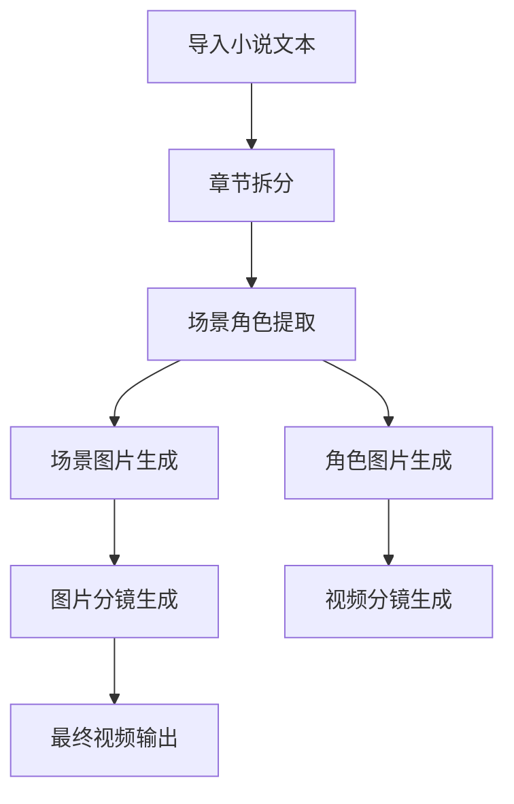
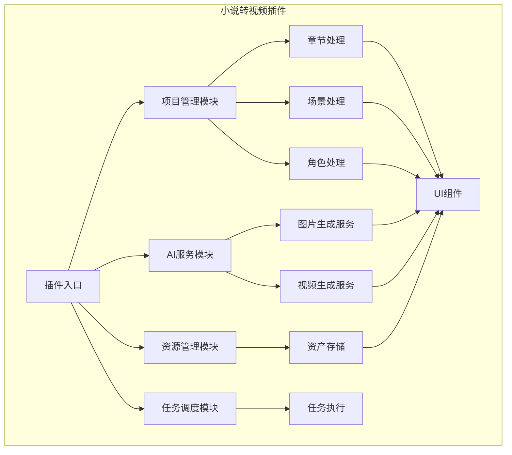
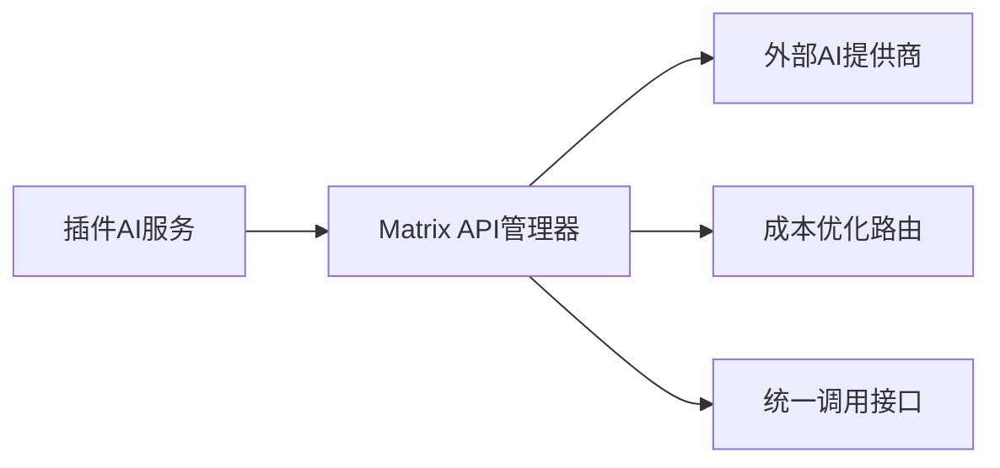
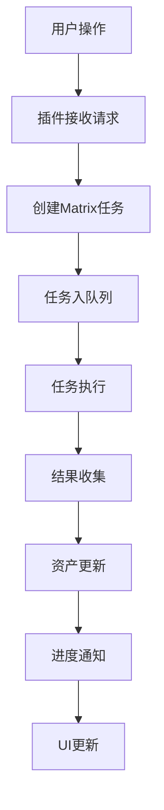

# 小说转视频插件迁移计划

## 项目概述

本文档详细分析了ai-playlet项目的小说转视频功能实现，并制定了将其作为插件迁移到Matrix项目的完整方案。

## 1. ai-playlet项目核心架构分析

### 1.1 核心功能模块

ai-playlet项目是一个基于Electron的AI视频生成系统，主要包含以下核心模块：

#### 数据模型层
- **Project**: 项目管理，包含小说路径、章节列表、封面图片等
- **Chapter**: 章节管理，包含场景列表、角色列表、章节内容等
- **Scene**: 场景管理，包含场景描述、位置、氛围、图片状态等
- **Character**: 角色管理，包含角色描述、外观、图片状态等
- **ImageStoryboard**: 图片分镜管理，包含描述、生成配置等
- **VideoStoryboard**: 视频分镜管理，包含生成模式、视频路径等
- **Task**: 任务管理，包含任务类型、状态、进度等

#### AI服务抽象层
- **ISceneCharacterExtractor**: 场景和角色提取接口
- **IImageProvider**: 图片生成提供者接口
- **IVideoProvider**: 视频生成提供者接口
- **IAudioProvider**: 音频生成提供者接口

#### 业务服务层
- **ChapterService**: 章节服务，负责场景和角色提取
- **ResourceService**: 资源生成服务，负责图片、视频生成
- **TaskQueueService**: 任务队列服务，负责异步任务执行

#### Agent模块
- **LangChainAgent**: 基于LangChain的AI调用封装，支持结构化输出
- **AgentSceneCharacterExtractor**: 场景角色提取的具体实现

### 1.2 核心工作流程



## 2. Matrix项目插件系统和资源管理能力分析

### 2.1 插件系统架构

Matrix项目具备完整的插件系统：

- **PluginManager**: 支持插件加载/卸载、权限管理、沙箱执行
- **插件类型**: 支持official/community分类
- **插件接口**: 标准化的插件API（activate、deactivate、execute）
- **插件生命周期**: 完整的插件生命周期管理

### 2.2 资源管理能力

- **AssetManager**: 支持项目/全局资产作用域管理
- **AI属性支持**: 完整的AI资产元数据管理
- **资产提升**: 支持项目资产升级为全局资产
- **资产搜索**: 支持标签、类型、时间范围搜索

### 2.3 API管理能力

- **APIManager**: 支持多提供商API管理
- **密钥管理**: 安全的API密钥存储和管理
- **智能路由**: 支持成本优化和提供商切换
- **状态监控**: API可用性检测和错误处理

### 2.4 任务调度能力

- **TaskScheduler**: 支持任务队列、并发控制、重试机制
- **任务状态跟踪**: 完整的任务生命周期管理
- **事件通知**: 任务状态变化的实时推送

## 3. 小说转视频插件架构设计

### 3.1 插件总体架构



### 3.2 核心模块设计

#### 3.2.1 插件入口模块 (NovelToVideoPlugin)
- **插件清单**: 定义插件所需的权限和依赖
- **插件配置**: 配置AI提供商、艺术风格等参数
- **插件初始化**: 建立与Matrix系统的连接

#### 3.2.2 项目管理模块 (ProjectModule)
- **项目创建**: 基于小说文本创建Matrix项目结构
- **章节管理**: 导入/创建章节，与Matrix项目管理系统集成
- **项目同步**: 保持与Matrix项目管理器的一致性

#### 3.2.3 AI服务模块 (AIServiceModule)
- **AI提供商适配**: 将ai-playlet的AI接口适配到Matrix的APIManager
- **结构化输出**: 利用Matrix的Agent模块进行AI调用
- **错误处理**: 统一的错误处理和重试机制

#### 3.2.4 资源管理模块 (ResourceModule)
- **资产存储**: 使用Matrix的AssetManager存储生成的图片、视频
- **元数据管理**: 维护AI生成参数、版本信息
- **资产关联**: 建立场景、角色、分镜之间的关联关系

#### 3.2.5 任务调度模块 (TaskModule)
- **任务创建**: 通过Matrix的TaskScheduler创建异步任务
- **状态同步**: 实时同步任务状态到Matrix系统
- **结果收集**: 收集生成结果并更新相关资产

#### 3.2.6 UI组件模块 (UIModule)
- **项目浏览器**: 集成到Matrix的项目管理界面
- **任务监控**: 集成到Matrix的任务监控面板
- **进度显示**: 实时显示生成进度
- **结果预览**: 集成到Matrix的资产预览功能

## 4. 插件与Matrix系统集成接口规范

### 4.1 插件清单接口

```typescript
interface NovelToVideoPluginManifest {
  id: string
  name: string
  version: string
  description: string
  author: string
  
  // 插件类型
  type: 'official' | 'community'
  
  // 所需权限
  permissions: Array<
    'project:read' | 'project:write' |
    'asset:read' | 'asset:write' |
    'api:call' | 'task:create' | 'task:execute'
  >
  
  // 依赖的Matrix服务
  dependencies: {
    assetManager: boolean
    apiManager: boolean
    taskScheduler: boolean
    projectManager: boolean
  }
  
  // 配置选项
  configSchema: {
    aiProvider?: 'openai' | 'deepseek' | 'anthropic'
    artStyle?: string
    maxConcurrentTasks?: number
  }
}
```

### 4.2 插件API接口

```typescript
interface NovelToVideoPluginAPI {
  // 插件生命周期
  activate(context: PluginContext): Promise<void>
  deactivate(): Promise<void>
  
  // 核心功能
  importNovel(filePath: string): Promise<void>
  extractChapters(projectId: string): Promise<void>
  generateSceneImages(projectId: string, sceneIds: string[]): Promise<void>
  generateCharacterImages(projectId: string, characterIds: string[]): Promise<void>
  generateStoryboards(projectId: string, sceneIds: string[]): Promise<void>
  generateVideos(projectId: string, storyboardIds: string[]): Promise<void>
  
  // 配置管理
  getConfig(): PluginConfig
  updateConfig(config: Partial<PluginConfig>): Promise<void>
}
```

### 4.3 插件上下文接口

```typescript
interface PluginContext {
  // Matrix系统服务
  assetManager: AssetManager
  apiManager: APIManager
  taskScheduler: TaskScheduler
  projectManager: ProjectManager
  
  // 插件配置
  config: PluginConfig
  
  // 工具函数
  createTask(type: string, params: any): Promise<string>
  emitProgress(taskId: string, progress: number): void
  emitCompletion(taskId: string, result: any): void
}
```

## 5. 数据模型迁移和适配方案

### 5.1 数据模型映射

| ai-playlet模型 | Matrix适配方案 |
|---|---|---|
| Project → Matrix.Project | 直接映射，补充artStyle字段 |
| Chapter → Matrix.Chapter | 直接映射，补充场景/角色关联 |
| Scene → Matrix.AssetConfig | 转换为AssetConfig，type='scene' |
| Character → Matrix.AssetConfig | 转换为AssetConfig，type='character' |
| ImageStoryboard → Matrix.AssetConfig | 转换为AssetConfig，type='image-storyboard' |
| VideoStoryboard → Matrix.AssetConfig | 转换为AssetConfig，type='video-storyboard' |
| Task → Matrix.Task | 直接映射，补充pluginId字段 |

### 5.2 AI服务适配策略

1. **图片生成服务适配**
   - 将ai-playlet的IImageProvider实现包装为Matrix的API调用
   - 利用Matrix的APIManager进行外部AI服务调用
   - 保持生成参数和配置的一致性

2. **视频生成服务适配**
   - 将ai-playlet的IVideoProvider实现包装为Matrix的API调用
   - 支持三种生成模式的统一接口
   - 利用Matrix的TaskScheduler进行异步执行

3. **Agent模块集成**
   - 复用ai-playlet的LangChainAgent核心逻辑
   - 适配到Matrix的配置管理系统
   - 保持结构化输出和错误处理机制

## 6. AI服务集成方案

### 6.1 AI提供商管理



#### 集成策略：
1. **提供商抽象**: 使用Matrix的APIManager统一管理多个AI提供商
2. **密钥管理**: 利用Matrix的安全存储机制管理API密钥
3. **智能路由**: 根据任务类型和成本自动选择最优提供商
4. **调用封装**: 将ai-playlet的AI调用逻辑封装为Matrix服务

### 6.2 具体实现方案

#### 图片生成服务
```typescript
class NovelToVideoImageProvider implements IImageProvider {
  constructor(
    private matrixApiManager: APIManager,
    private pluginConfig: PluginConfig
  ) {}
  
  async generateImage(prompt: string, options?: ImageGenerationOptions): Promise<string> {
    // 1. 选择最优提供商
    const provider = await this.selectOptimalProvider('image')
    
    // 2. 调用Matrix API管理器
    const result = await this.matrixApiManager.callAPI(provider.name, {
      prompt,
      model: options?.model,
      size: options?.size,
      style: this.pluginConfig.artStyle
    })
    
    // 3. 处理结果并返回临时文件路径
    return result.tempPath
  }
}
```

#### 视频生成服务
```typescript
class NovelToVideoVideoProvider implements IVideoProvider {
  constructor(
    private matrixApiManager: APIManager,
    private pluginConfig: PluginConfig
  ) {}
  
  async generateVideoFromText(prompt: string, options?: VideoGenerationOptions): Promise<string> {
    const provider = await this.selectOptimalProvider('video')
    return await this.matrixApiManager.callAPI(provider.name, {
      prompt,
      mode: 'text-to-video',
      ...options
    })
  }
  
  async generateVideoFromImage(imagePath: string, prompt: string, options?: VideoGenerationOptions): Promise<string> {
    const provider = await this.selectOptimalProvider('video')
    return await this.matrixApiManager.callAPI(provider.name, {
      image: imagePath,
      prompt,
      mode: 'image-to-video',
      ...options
    })
  }
  
  async generateVideoFromImages(imagePaths: string[], prompt: string, options?: VideoGenerationOptions): Promise<string> {
    const provider = await this.selectOptimalProvider('video')
    return await this.matrixApiManager.callAPI(provider.name, {
      images: imagePaths,
      prompt,
      mode: 'images-to-video',
      ...options
    })
  }
}
```

## 7. 任务调度和执行流程集成

### 7.1 任务创建流程



#### 实现步骤：
1. **任务创建**: 插件通过context.createTask()创建任务
2. **参数验证**: 验证输入参数的有效性
3. **任务入队**: 提交给Matrix的TaskScheduler
4. **状态跟踪**: 监听任务状态变化
5. **结果处理**: 任务完成后更新相关资产

### 7.2 进度通知机制

```typescript
// 插件通过context通知进度
await context.emitProgress(taskId, 0.3) // 30%
await context.emitProgress(taskId, 0.7) // 70%
await context.emitProgress(taskId, 1.0) // 100%

// 任务完成后通知结果
await context.emitCompletion(taskId, {
  sceneImages: generatedImages,
  characterImages: generatedCharacters,
  videos: generatedVideos
})
```

## 8. UI组件集成方案

### 8.1 界面集成点

1. **项目管理面板**: 添加"小说转视频"项目类型选项
2. **插件配置面板**: 新增插件专用配置界面
3. **任务监控面板**: 显示插件任务的执行状态
4. **资产预览**: 集成生成的场景图、角色图、视频分镜

### 8.2 组件扩展

```typescript
// 扩展现有的资产组件
interface AssetCardProps extends AssetCardProps {
  pluginId?: string  // 标识来源于哪个插件
  generationParams?: any  // 显示生成参数
}

// 新增插件专用组件
interface PluginConfigPanelProps {
  pluginId: string
  configSchema: any
  onConfigChange: (config: any) => void
}
```

## 9. 插件开发规范和模板

### 9.1 插件目录结构

```
plugins/novel-to-video/
├── manifest.json          # 插件清单
├── main.ts              # 插件主入口
├── services/           # 服务模块
│   ├── ProjectModule.ts
│   ├── AIServiceModule.ts
│   ├── ResourceModule.ts
│   └── TaskModule.ts
├── types/              # 类型定义
│   ├── plugin.ts
│   └── mapping.ts
├── ui/                 # UI组件
│   ├── ProjectPanel.tsx
│   ├── ConfigPanel.tsx
│   ├── TaskMonitor.tsx
│   └── AssetPreview.tsx
└── README.md             # 插件说明文档
```

### 9.2 插件模板

提供完整的插件开发模板，包括：
- 标准manifest.json结构
- 插件主入口模板
- 服务模块模板
- UI组件模板
- 配置管理模板
- 错误处理模板

### 9.3 开发检查清单

- [ ] 插件清单完整性验证
- [ ] 权限声明正确性检查
- [ ] Matrix服务集成测试
- [ ] 错误处理完整性验证
- [ ] UI组件响应性测试
- [ ] 插件卸载清理测试

## 10. 详细实施步骤

### 10.1 第一阶段：基础架构搭建

1. **创建插件目录结构**
   - 在Matrix项目的plugins目录下创建novel-to-video文件夹
   - 建立标准的插件目录结构

2. **实现插件清单**
   - 创建符合Matrix插件规范的manifest.json
   - 定义插件权限和依赖

3. **实现插件主入口**
   - 创建NovelToVideoPlugin主类
   - 实现activate/deactivate生命周期
   - 建立与Matrix服务的连接

### 10.2 第二阶段：服务模块实现

1. **项目管理模块**
   - 实现ProjectModule类
   - 集成Matrix的ProjectManager
   - 实现项目创建和章节管理功能

2. **AI服务模块**
   - 实现AIServiceModule类
   - 包装ai-playlet的AI调用逻辑
   - 适配到Matrix的APIManager和配置管理

3. **资源管理模块**
   - 实现ResourceModule类
   - 使用Matrix的AssetManager存储生成资源
   - 维护资源元数据和关联关系

4. **任务调度模块**
   - 实现TaskModule类
   - 使用Matrix的TaskScheduler执行异步任务
   - 实现任务状态跟踪和进度通知

### 10.3 第三阶段：UI组件开发

1. **项目面板扩展**
   - 扩展现有的Projects组件
   - 添加"小说转视频"项目类型支持
   - 集成插件项目管理功能

2. **插件配置面板**
   - 创建PluginConfigPanel组件
   - 实现插件参数配置界面
   - 支持实时配置更新

3. **任务监控面板**
   - 创建PluginTaskMonitor组件
   - 实时显示插件任务执行状态
   - 支持任务取消和重试

4. **资产预览组件**
   - 扩展现有的AssetPreview组件
   - 支持插件生成资源的预览
   - 显示生成参数和元数据

### 10.4 第四阶段：集成测试

1. **单元测试**
   - 测试各个服务模块的功能
   - 验证数据模型转换正确性
   - 测试插件生命周期管理

2. **集成测试**
   - 测试插件与Matrix系统的集成
   - 验证API调用正确性
   - 测试任务创建和执行流程

3. **UI测试**
   - 测试新增的UI组件功能
   - 验证用户交互响应性
   - 测试配置更新和状态同步

### 10.5 第五阶段：部署和文档

1. **插件打包**
   - 创建符合Matrix插件规范的安装包
   - 包含所有必要的依赖和资源

2. **文档编写**
   - 编写详细的插件使用说明
   - 提供配置参数说明
   - 创建示例和最佳实践

3. **发布准备**
   - 验证插件完整性
   - 创建插件版本标记
   - 准备发布说明

## 11. 验证方案

### 11.1 功能验证

- [ ] 小说导入功能正常
- [ ] 章节拆分准确
- [ ] 场景角色提取正确
- [ ] 图片生成质量合格
- [ ] 视频生成功能正常
- [ ] 任务调度稳定
- [ ] 资源管理完整
- [ ] UI响应及时

### 11.2 性能验证

- [ ] 大文件处理性能
- [ ] 并发任务处理能力
- [ ] 内存使用合理
- [ ] API调用响应时间
- [ ] 错误恢复机制有效

### 11.3 兼容性验证

- [ ] 与Matrix现有插件兼容
- [ ] 数据模型向后兼容
- [ ] API接口版本兼容
- [ ] 配置迁移平滑

### 11.4 安全验证

- [ ] 权限控制有效
- [ ] API密钥安全存储
- [ ] 文件访问限制正确
- [ ] 输入验证完整
- [ ] 错误信息安全处理

## 12. 风险评估和缓解

### 12.1 技术风险

1. **数据模型不兼容**
   - 风险：字段缺失或类型不匹配
   - 缓解：建立完整的字段映射和转换逻辑

2. **AI服务集成复杂**
   - 风险：API接口差异导致功能异常
   - 缓解：设计适配器模式，统一接口调用

3. **插件生命周期管理**
   - 风险：插件异常退出影响系统稳定性
   - 缓解：实现完整的清理机制和错误处理

### 12.2 缓解措施

1. **渐进式迁移**
   - 分阶段实施，每个阶段都有明确的验证点
   - 保持现有功能不受影响

2. **向后兼容**
   - 保持Matrix现有API的稳定性
   - 新增功能通过扩展方式实现

3. **回退机制**
   - 插件异常时自动禁用
   - 保持ai-playlet原功能作为备选方案

4. **监控和日志**
   - 详细的操作日志记录
   - 关键指标监控和告警

## 13. 总结

本方案通过将ai-playlet的小说转视频功能作为插件迁移到Matrix项目，实现了：

1. **完整的功能保留**: 所有核心功能都得到保留和增强
2. **系统集成**: 与Matrix现有的插件系统、资源管理、API管理无缝集成
3. **架构优化**: 基于Matrix的强架构重新设计，提升了可维护性和扩展性
4. **开发效率**: 通过标准化的插件开发模板和工具支持，提高开发效率
5. **质量保证**: 通过多层次的验证和测试确保功能质量

该方案既保持了ai-playlet项目的核心功能，又充分利用了Matrix项目的架构优势，实现了双赢的迁移效果。